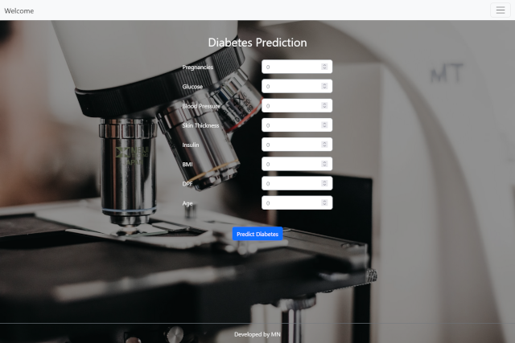
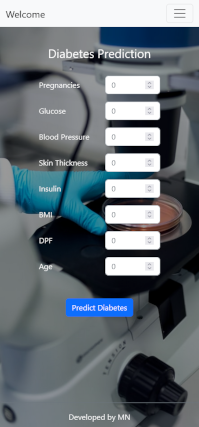

# Diabetes Prediction App with Scikit-learn and Flask

This project consists of the development of a predictive model that is capable of predicting diabetes based on a patient's data (Pregnancies, Glucose, Blood Pressure, Skin Thickness, Insulin, BMI, DPF, Age).

Packages used: Numpy, Pandas, Pandas-profiling, Scikit-learn, Joblib, Flask


###### *This project is based on a Leire Ahedo course.*

<br>

### The application is ready for deployment.
----

#### Deploy with the next files:

```
├── app
│   ├── static
│   ├── templates
│   ├── __init__.py
│   └── prediction.py
├── models
│   ├── model.joblib
│   └── scaler.joblib
├── Procfile
└── requirements.txt

```

Set your environmet variable `'SECRET_KEY'`.

<br><br>

## Run locally:
----
```
pip install -r requirements.txt
```
    
```
flask --app app --debug run
```
<br><br>

## App UI:
----
<br>

<div style="text-align:center"></div>

<br>

<div style="text-align:center"></div>